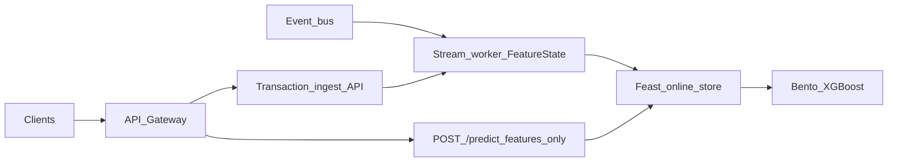

# API contract + Feast streaming plan

## Evaluation of your approach

Your [scale fraud MVP plan](.cursor/plans/scale_fraud_mvp_eac7a314.plan.md) is **directionally correct** for this repository:

- **Ground truth**: `[FraudScoringService](src/serving/bento_service.py)` only accepts precomputed features (`PredictRequest` is a flat `FEATURE_COLUMNS` model); `[build_features.py](src/features/build_features.py)` holds the real online semantics in `FeatureState` (24h/1h windows, sender / pair / beneficiary keys). The scale plan correctly identifies that **moving features online** is the main lever—not raw XGBoost QPS.
- **API split (feature service vs model-only Bento)** remains the **cleanest** boundary when adding Feast: callers either send **raw events** to a feature path, or **features** to `/predict`. That avoids coupling Bento releases to Feast registry changes and lets you scale retrieval and inference independently.
- **Where to tighten the plan for Feast specifically**:
  - **Feast is not the stream processor.** It is a **feature registry + online/offline store** (and optional materialization). You still need a component that ingests ordered transactions, maintains the same windowed logic as `FeatureState` (or emits equivalent aggregates), and **writes** rows into Feast’s online store (and offline for training). Without that, “stream into Feast” is only a schema exercise.
  - **Entity coverage**: Your features mix **sender-scoped**, **beneficiary-scoped**, and **(sender, beneficiary) pair** signals. Feast entity keys must include **pair** where needed (e.g. `seconds_since_last_pair_txn`, `pair_txn_count_24h`), not only sender and beneficiary—otherwise retrieval cannot reconstruct training-time semantics.
  - **Ordering and time**: `compute_row_features` assumes **prior history only** before `update`. The streaming layer must guarantee **per-key ordering** (or event-time + buffering) so online features match `[build_features](src/features/build_features.py)` / `[build_features_for_incoming](src/features/build_features.py)`.

**Verdict**: Keep your sequencing (contract → persisted/streamed state → horizontal scale of inference). Add an explicit **“state + writer”** box between the message bus and Feast, and treat Feast as the **contract store** for features, not the windowing engine.

---

## 1. API contract (what to implement)

**Goals**: Stable JSON schemas, explicit versioning, backward compatibility for existing `[PredictRequest](src/serving/bento_service.py)` consumers.

| Surface                                            | Purpose                                                                                                                                         |
| -------------------------------------------------- | ----------------------------------------------------------------------------------------------------------------------------------------------- |
| `**POST /v1/transactions:score` (or `/v1/score`)** | **Primary**: raw transaction + optional `transaction_id`; server resolves features (Feast online read) then calls existing `run_predict`.       |
| `**POST /predict` (unchanged or `/v1/predict`)**   | **Legacy / debug**: full feature vector exactly as today—same fields as `FEATURE_COLUMNS` in `[train_xgboost.py](src/models/train_xgboost.py)`. |

**Pydantic models** (new module, e.g. `[src/serving/contracts.py](src/serving/contracts.py)`):

- `**RawTransactionRequest`**: `transaction_id` (optional UUID/string), `timestamp` (ISO 8601), `amount`, `sender_account`, `beneficiary_account` — mirror CSV columns used in `[build_features](src/features/build_features.py)`; reject self-transfers like batch code.
- `**ScoreResponse**`: extend or wrap current `[PredictResponse](src/serving/bento_service.py)` with optional `transaction_id`, `feature_names`/`features` (for observability, gated by env flag to avoid leaking internals in prod).

**Non-functional**: document **idempotency** (`transaction_id` + dedupe in ingest), **timeouts** for Feast reads, and **error shape** (400 validation vs 503 upstream store).

**Tests**: Mirror patterns in `[tests/test_bento_service.py](tests/test_bento_service.py)` / `[tests/test_bento_service_http.py](tests/test_bento_service_http.py)` for the new route; keep existing `/predict` tests green.

---

## 2. Feast project layout (greenfield)

Add a `**feature_repo/`** (name flexible) at repo root:

- `**feature_store.yaml**`: provider (file/S3/GCS for offline), **online store** (Redis or Dynamo—team choice), registry config.
- **Entities**: at minimum `sender_account`, `beneficiary_account`, and a **pair** entity (`sender_id`, `beneficiary_id`) or composite key string used consistently in views.
- **Feature views**: one view per retrieval “row” you need at scoring time—likely a **single wide view** keyed by the **finest grain needed for a request** (often **transaction-level** push of a precomputed vector) *or* multiple views joined in code. Given your vector is **one row per transaction** with mixed scopes, the pragmatic MVP is often:
  - **Push feature view** (streamed): materialize the **full `FEATURE_COLUMNS` dict** plus ids/timestamp as a **single entity** = `transaction_id` (if always present) **or** composite `(timestamp, sender, beneficiary)` with strict ordering rules.
  - Document tradeoff: entity-per-transaction grows storage; acceptable for MVP volume.
- **Data sources**: batch Parquet/CSV for backfill; **stream source** (Kafka topic) if using native Feast stream ingestion, else **custom push** from your worker via Feast Python API.

**Dependency**: add `feast` to `[pyproject.toml](pyproject.toml)` and pin a version; add CI step `feast apply` (dry-run in PR) if you use declarative registry.

---

## 3. Streaming path (features into Feast)

1. **Ingress**: HTTP `POST /v1/transactions:score` **and/or** published events to a bus (Kafka/PubSub)—same canonical payload as `RawTransactionRequest`.
2. **Worker** (new package, e.g. `src/streaming/`):
  - Maintain `**FeatureState`** (reuse class from `[build_features.py](src/features/build_features.py)`) **per partition** if you shard by sender hash, or **single logical state** only if throughput is low (not production-scale—document limitation).
  - For each message: `compute_row_features` → **then** `update` (same order as training loop in `build_features`).
  - **Write to Feast online store** with `to_df` / `write_to_online_store` (Feast API) including entity ids and timestamp for point-in-time.
3. **Serving read path**: `get_online_features` (or equivalent) in the feature service using the **same entity keys** and **event timestamp** as the writer.
4. **Offline / training**: schedule **materialization** or batch export so batch training can reproduce online features (Feast’s value prop). Align labels with existing pipeline in `[train_xgboost.py](src/models/train_xgboost.py)`.

**Sharding note**: At high QPS, **hot keys** on `sender_account` require partition affinity or external store (Redis) for state; Feast then holds **served snapshots**, not the only copy of state. Your MVP plan’s Redis/stream-processor bullet still applies—Feast complements it.

---

## 4. Sequencing (recommended)

1. **Lock the JSON contract** (`RawTransactionRequest` / `ScoreResponse`) and add the new route **behind a feature flag** with a **fake in-memory** `FeatureState` for local dev (parity tests vs `build_features_for_incoming`).
2. **Introduce Feast** with a **single push-based feature view** and local Redis; prove **write → read → predict** in an integration test.
3. **Wire the stream worker** to replace the fake with durable ingestion + Feast writes.
4. **Harden**: metrics, idempotency, failure handling, then MLflow cache items from the parent plan as separate work.

---

## 5. Risks to track

- **Semantic drift**: If the worker’s ordering differs from batch `build_features`, metrics drop. Add **golden tests**: same history → features equal within tolerance.
- **Feast operational cost**: Another moving part; for a tiny team, validate you need both **Feast** and **Redis** vs a thinner “feature API + Redis” first—but if training/serving skew is a priority, Feast earns its keep.

