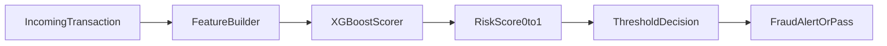

# Fraud Detection MVP Plan

## Scope
Build a simple end-to-end pipeline that:
- Simulates transactions among 30 accounts
- Injects fraud behavior from a colluding group of 5 accounts
- Produces partially labeled fraud data (some fraud transactions flagged)
- Trains and evaluates an XGBoost binary classifier for fraud scoring

## Proposed Project Structure
- Data simulation module: [src/data/simulate_transactions.py](src/data/simulate_transactions.py)
- Feature engineering module: [src/features/build_features.py](src/features/build_features.py)
- Model training module: [src/models/train_xgboost.py](src/models/train_xgboost.py)
- Inference/scoring module: [src/models/score_transaction.py](src/models/score_transaction.py)
- Config for reproducibility: [config/simulation.yaml](config/simulation.yaml)
- Output datasets/artifacts:
  - [data/raw/transactions.csv](data/raw/transactions.csv)
  - [data/processed/model_dataset.csv](data/processed/model_dataset.csv)
  - [models/xgboost_fraud_model.json](models/xgboost_fraud_model.json)

## Data Simulation Design
- Universe: 30 unique account IDs (`A001` ... `A030`)
- Generate timestamped transactions across a configurable date range
- Fields per transaction:
  - `transaction_id`
  - `timestamp`
  - `amount`
  - `sender_account`
  - `beneficiary_account`
- Constraint: enforce `sender_account != beneficiary_account`
- Amount distribution:
  - Mostly normal/typical behavior (small-to-medium values)
  - Minority of high-value outliers

## Fraud Injection and Labels
- Randomly designate 5 colluding accounts (fixed seed for reproducibility)
- Inject fraud-like patterns among colluders, e.g.:
  - Higher frequency circular transfers
  - Bursty transfers in short windows
  - Repeated sender-beneficiary pair transfers
  - Structuring-style amounts near thresholds
- Labeling strategy:
  - `is_fraud_ground_truth` for all injected fraud events (internal truth)
  - `is_fraud_label` as partial observed labels (only a subset of fraud events flagged)
- Training target for supervised baseline:
  - Use `is_fraud_label` as target to match real-world weak supervision
  - Retain `is_fraud_ground_truth` for offline diagnostic comparison

## Feature Engineering (Transaction-Level)
Create features available at scoring time:
- Raw: `amount`, hour/day-of-week from `timestamp`
- Sender historical behavior:
  - recent txn count windows (e.g., 1h, 24h)
  - sender avg amount, std amount
- Sender-beneficiary pair behavior:
  - pair frequency windows
  - time since last transfer between pair
- Beneficiary risk proxies:
  - inbound txn velocity
  - number of unique counterparties
- Add leakage checks so features only use past information

## Modeling and Evaluation
- Train/validation/test split by time (not random) to mimic production
- Baseline model: XGBoost binary classifier
- Handle class imbalance with `scale_pos_weight` and threshold tuning
- Primary metrics:
  - PR-AUC (key for imbalanced fraud detection)
  - ROC-AUC
  - Precision/Recall at top-K and chosen threshold
- Calibrate decision threshold for operational trade-off (precision vs recall)

## Serving Flow (MVP)

- For each new transaction, compute the same features as training
- Return `fraud_score` in [0,1] plus binary decision (`flagged`/`not_flagged`)
- Log predictions for monitoring and future retraining

## Validation Checks and Guardrails
- Data quality checks:
  - no self-transfers
  - unique `transaction_id`
  - monotonic timestamp parsing
- Fraud injection sanity:
  - confirm fraud concentration among colluding accounts
  - verify partial-label coverage ratio (e.g., 20-40% of fraud labeled)
- Reproducibility:
  - fixed random seed and config-driven parameters

## Deliverables
- Configurable data simulator producing realistic normal + fraudulent behavior
- Labeled dataset with both observed labels and hidden ground truth
- Trained XGBoost baseline with saved model artifact
- Script/function to score incoming transactions consistently with training features
- Short experiment report (metrics + confusion matrix + threshold recommendation)
