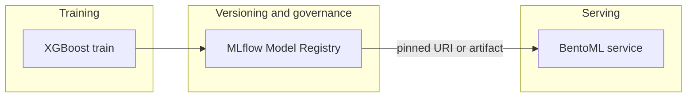

# Model registry critique and improvement plan

## Current setup (what exists today)

| Layer                                                                        | Role in this repo                                                                                                                                                                                      |
| ---------------------------------------------------------------------------- | ------------------------------------------------------------------------------------------------------------------------------------------------------------------------------------------------------ |
| **Training** (`[src/models/train_xgboost.py](src/models/train_xgboost.py)`)  | Writes canonical artifacts: `model.save_model()` → `models/xgboost_fraud_model.json`, plus `[training_metrics.json](src/models/train_xgboost.json)` (feature order, threshold, metrics).               |
| **MLflow**                                                                   | Optional (`--mlflow`): logs params/metrics and, when enabled, `**mlflow.log_artifact`** for the JSON model and metrics—not `mlflow.xgboost.log_model`, and **no** `register_model` / stages / aliases. |
| **BentoML** (`[src/serving/bento_service.py](src/serving/bento_service.py)`) | Service loads `**XGBClassifier` from `MODEL_PATH`** and metadata from `**METRICS_PATH`**. No `bentoml.models.save_model` / BentoML model store.                                                        |

So “registry” is effectively **mutable paths on disk** (`models/…`) plus **MLflow run history** as a second copy of files when training with MLflow—without promotion semantics or a single source of truth for production.

### Critique (main gaps)

1. **No registry semantics** — Artifacts are files; there is no “this run is production,” no immutable version pin for deploys, no audit trail separate from “whatever file is in `models/`.”
2. **MLflow used as a file drop, not as models** — `log_artifact` does not register an MLflow “model” with flavor metadata, signature, or standard loading APIs (`mlflow.xgboost.load_model`). That limits downstream tooling (batch scoring, validation, some deployment integrations).
3. **Split brain** — Serving (`[bento_service.py](src/serving/bento_service.py)`) and `[score_transaction.py](src/models/score_transaction.py)` depend on **two** files staying in sync; promoting a model in MLflow does not automatically update what BentoML uses unless your deploy pipeline copies or points paths.
4. **BentoML is not acting as a model store** — It is a **runtime** for HTTP APIs. Saving “into BentoML” would mean using BentoML’s model/bento build APIs; that is orthogonal to whether you also use MLflow for lineage.

---

## Should you save models with MLflow or BentoML?

**Recommendation: use MLflow (properly) as the system of record for trained model *versions*; use BentoML for *how* you run inference, not as the primary registry.**

They solve different problems:

| Concern                                                     | MLflow                                                                                                                  | BentoML                                                                                                |
| ----------------------------------------------------------- | ----------------------------------------------------------------------------------------------------------------------- | ------------------------------------------------------------------------------------------------------ |
| **Experiment comparison, params/metrics**                   | Strong (your current use)                                                                                               | Not its focus                                                                                          |
| **Versioned model binary + promotion (staging/production)** | **Model Registry** (stages, aliases)                                                                                    | Tags/versions in Bento store, less common as org-wide “registry”                                       |
| **Lineage / compliance**                                    | Fits audit and “which data produced this model”                                                                         | Weaker unless you duplicate metadata                                                                   |
| **Deployable unit (API + deps + optional preprocessing)**   | `mlflow models build/serve` or export to external deploy                                                                | **Bento** is built for this                                                                            |
| **Duplication**                                             | If you also `bentoml.models.create` for every train, you maintain **two** stores unless you automate one from the other | Prefer **one** canonical store (usually MLflow) and build Bentos in CI from a **pinned** model version |

**When BentoML-only storage might be enough:** small team, no MLflow server, single deployment path, and you only care about “latest bento tag”—not cross-team experiment comparison or regulatory lineage.

**When MLflow-only might be enough:** if you only need batch scoring and `mlflow models serve` (or framework-native batch), you might skip BentoML until you need a custom API, multi-step pipelines, or Bento-specific deployment.

**Typical mature pattern for your stack (XGBoost + HTTP):**  
`mlflow.xgboost.log_model` + **Model Registry** for the artifact + metrics sidecar (or params) → CI or deploy step **loads that URI** (or exports to container) → **BentoML service** loads the same artifact at startup (or bakes it into a Bento build). BentoML does not need to “own” the registry.

---

## Improvement plan (practical order)

1. **Adopt MLflow Models API for training** — In `[train_xgboost.py](src/models/train_xgboost.py)`, add `mlflow.xgboost.log_model` (with `signature` / `input_example` if you want contract checks). Keep writing local JSON if useful for dev, or treat MLflow as the only promoted artifact for non-dev.
2. **Register and promote** — After logging, call `mlflow.register_model` (or use the UI) and use **aliases** (e.g. `champion`) or **stages** for production. Document the promotion workflow in the README (no new markdown file unless you want it).
3. **Pin serving to a version** — For production, set `MODEL_PATH` / deployment to either: (a) download artifact from MLflow for a specific run/model version, or (b) bake the resolved file into the image in CI from a **pinned** `models:/` URI. Avoid relying on an unversioned `models/` directory in prod.
4. **Optional: Bento build from pinned model** — Add a `bentoml build` step that packages the service **with** the model artifact resolved from MLflow at build time, so the running unit is immutable.
5. **Infrastructure** — `[docker-compose.yml](docker-compose.yml)` uses SQLite + local artifacts; for team use, plan Postgres/MySQL backend and S3/GCS-backed artifact store (MLflow docs cover this). Not required for local dev.

---

## Summary tradeoff (direct answer)

- **Saving/registry:** Prefer **MLflow Model Registry** (with `log_model`, not only `log_artifact`) for versioned binaries, lineage, and promotion.  
- **Serving:** Keep **BentoML** as the API layer; optionally build Bentos from MLflow-pinned models.  
- **Avoid** choosing “only BentoML” for registry unless you explicitly reject MLflow’s governance features and accept a thinner versioning story.

