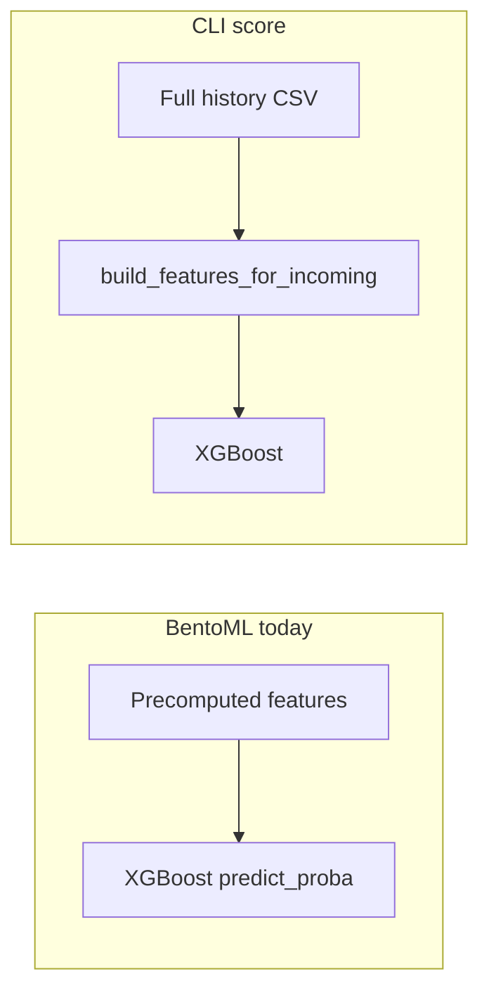

# Scaling the fraud detection MVP

## What exists today (ground truth)

The [README](README.md) states this is a **baseline MVP**, not a production fraud stack. The runtime split matters:

- **HTTP ([`src/serving/bento_service.py`](src/serving/bento_service.py))**: `POST /predict` accepts a `PredictRequest` with **all training feature columns** already populated; the service only runs `predict_proba` and applies the trained threshold. No rules engine, no raw transaction ingestion, no internal feature pipeline.

- **CLI ([`src/models/score_transaction.py`](src/models/score_transaction.py))**: Loads **the full history** with `pd.read_csv`, then calls `build_features_for_incoming` from [`src/features/build_features.py`](src/features/build_features.py). This path can compute features for one new row, but it is **not** what Bento exposes.

So the main “scale” gap is **not** XGBoost throughput alone—it is **where features come from** at high QPS and large history.

## How to scale up (recommended directions)

### 1. Online features (highest leverage)

[`build_features.py`](src/features/build_features.py) already implements **leakage-safe, windowed** logic via `FeatureState` (deques keyed by sender, pair, beneficiary). That is the right *shape* for streaming, but it is **in-memory and process-local** today.

To scale:

- **Persisted, keyed state** for rolling windows (e.g. per `sender_account`, `(sender, beneficiary)`, `beneficiary_account`) with TTL aligned to your max window (e.g. 24h in code). Candidates: Redis with careful key design, or a stream processor (Flink/Beam/ksql) emitting feature vectors to a **feature store** (Feast, Tecton-class, or a thin internal API).

- **API contract**: Either (a) keep Bento as “model only” and put a **feature service** in front, or (b) extend the Bento API to accept **raw transaction** fields and call into the same windowed logic backed by the store. Option (a) is usually cleaner for team boundaries and independent scaling.

**Bottleneck if ignored**: Any design that re-reads “full history” per request (like the CLI) will **linearly degrade** with CSV/DB size and fail on memory/latency.

### 2. Serving and inference

Once features are O(window) per entity, **XGBoost inference** is typically cheap; scale with:

- **Multiple replicas** behind a load balancer, **stateless** containers (model + metrics loaded at startup; see [`env_load_bundle`](src/serving/mlflow_model_loader.py) for registry-based loads).

- **Autoscaling** on CPU/latency/RPS; cap concurrency per pod to avoid tail latency spikes.

- Optional **GPU** is usually unnecessary for this-sized tabular XGBoost; profile first.

### 3. Async and control paths

Production systems usually separate:

- **Synchronous path**: minimal work (features + score + decision).

- **Async path**: audit logs, case management hooks, enrichment, model shadowing—via a **queue** (Kafka, SQS, etc.) so spikes do not block the sync path.

This repo has **no queue/worker** layer; adding one is a scaling lever for **downstream** load, not the model math.

### 4. MLflow and training

[`load_bundle_from_registry`](src/serving/mlflow_model_loader.py) uses `tempfile.mkdtemp` when no `MLFLOW_MODEL_CACHE_DIR` is set—fine for dev, but in many replicas you want a **stable cache** (shared volume or image bake) to avoid repeated downloads and temp churn.

For **experiment tracking**, the README’s SQLite-oriented local setup does not suit concurrent team writes; production tracking typically uses **Postgres + object storage** for artifacts.

### 5. Governance beyond the model

The codebase has **no** policy/rules layer (velocity caps, lists, manual overrides). At scale, teams often add **rules + model** (champion/challenger, shadow mode) and **observability** (feature drift, score distribution, latency SLOs).

---

## Bottlenecks to foresee (specific to this codebase)

| Area | Risk |
|------|------|
| **Feature computation** | Dominant if you naively port CLI behavior (full `read_csv` / unbounded history) to online traffic. |
| **HTTP vs CLI mismatch** | Bento does not run `build_features_for_incoming`; production must explicitly implement an online feature path. |
| **Per-entity hot keys** | Senders/beneficiaries with extreme volume need sharding, rate limits, or approximate windows to avoid single-key contention. |
| **MLflow registry pulls** | Without caching (`MLFLOW_MODEL_CACHE_DIR` or baked images), cold starts and repeated downloads hurt rollout and many replicas. |
| **Operational gaps** | No built-in rate limiting, idempotency, or backpressure—must come from the platform (API gateway, mesh, queue). |

---

## Practical sequencing

1. **Define the online contract**: raw txn → features → score vs features-only API with a separate feature pipeline.

2. **Back stateful windows** with a store/processor that matches `FeatureState` semantics (trim windows, no future leakage).

3. **Scale inference** horizontally once p95 feature latency is bounded.

4. **Harden MLflow** (tracking backend, artifact store, model cache) for CI/CD and multi-replica serve.

5. **Add async audit/enrichment** so sync latency stays predictable under growth.
