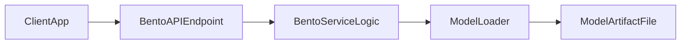

# Serve Classical ML Model With BentoML

## Goal
Expose your existing classical ML model file behind a simple HTTP inference API using BentoML.

## Phase 1 Architecture

## Scope (Phase 1 only)
- Use `BentoML` as the serving framework for this classical ML use case.
- Expose one inference endpoint (for example `/predict`) over HTTP.
- Load the existing model file at service startup and keep it in memory for request handling.
- Return prediction output in a stable JSON response schema.
- Keep auth, autoscaling, and advanced production concerns out of scope for now.

## Implementation steps
- Identify model format and loader (`pickle`, `joblib`, `xgboost`, `onnxruntime`, etc.).
- Create a Bento service class that initializes the model once.
- Define input schema (features payload) and output schema (prediction, optional score/probability).
- Implement endpoint handler that validates input and calls `model.predict(...)`.
- Run locally with BentoML server and validate with `curl`/HTTP client.

## Deliverable for this phase
- A working BentoML API service that accepts feature inputs and returns inference results from your existing model file.

## Assumptions
- You already have a trained model artifact.
- You only need inference API availability right now (no retraining pipeline).